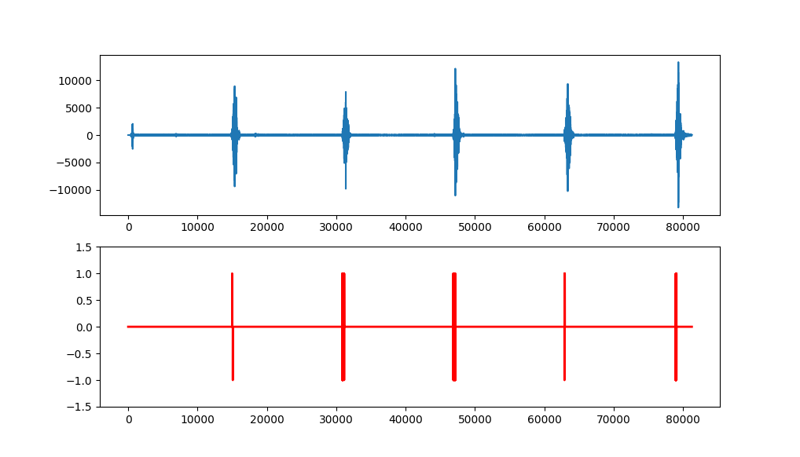

# Robust peak detection algorithm (using z-scores)

Implementation of algorithm from [Robust peak detection algorithm](https://stackoverflow.com/a/22640362) in Python.

This algorithm has been modified in order to work with real-time streams.
It doesn't recalculate all data points on arrival of a new one.

## Assumption
I used this algorithm with a watch ticks dataset, taken from a phone microphone.

For semplicity, lag is the same size of the first dataset `quartz1`, that is used to calculate the mean, the variance and the standard deviation of the first 1280 rows.
After the initialization, the stream has been simulated with the `quartz2` dataset; for every element, the mean, the variance and the standard deviation is recalculate.
